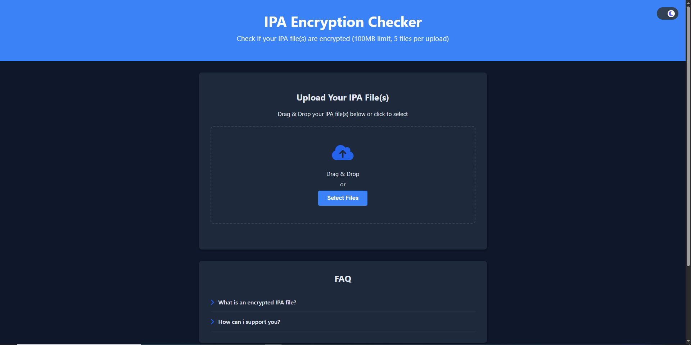

# [IPA Encryption Checker](https://andres9890.github.io/ipa-encryption-checker/)

## Screenshots:

## Description:

A website that checks if an IPA file is encrypted via a python script (provided by norep on the iOS Obscura discord server, credits to him)

## Techstack:

- Frontend is hosted on Github Pages
- Backend and File uploading is hosted on a CloudFlare worker and on CloudFlare R2

> [Terms of Service](https://andres9890.github.io/ipa-encryption-checker/routes/terms) | [Privacy Policy](https://andres9890.github.io/ipa-encryption-checker/routes/privacy) | [License](LICENSE) | [Script]([ipa_analyzer.py](https://andres9890.github.io/ipa-encryption-checker/routes/script)
