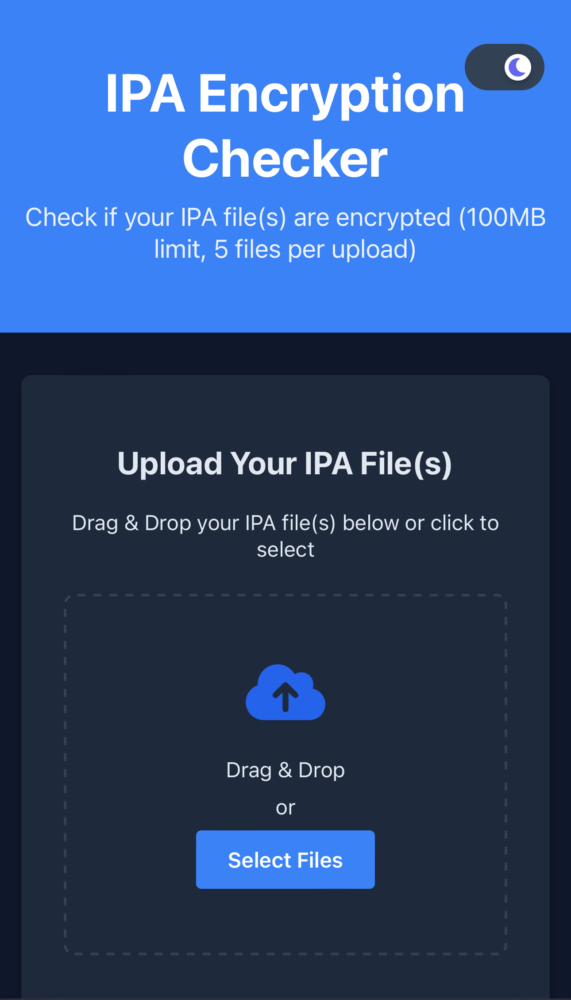
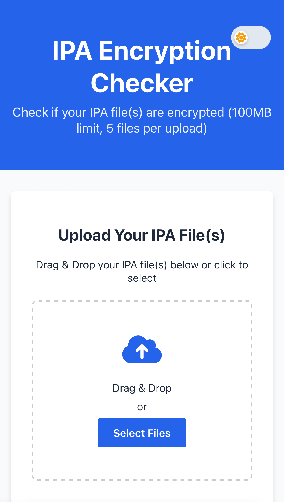
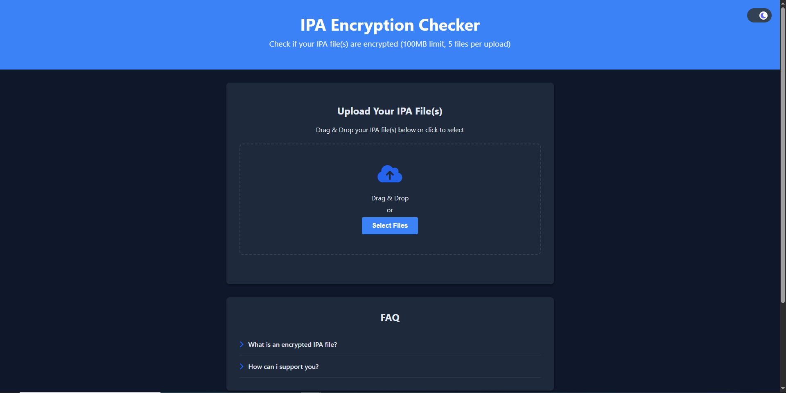
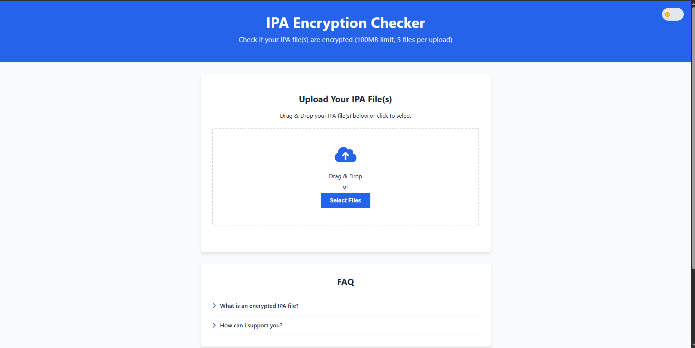

[Terms of Service Button]: https://img.shields.io/badge/Terms_of_Service-red
[Terms of Service Link]: https://ipachecker.com/routes/terms 'Terms of Service.'

[Privacy Policy Button]: https://img.shields.io/badge/Privacy_Policy-red
[Privacy Policy Link]: https://ipachecker.com/routes/privacy 'Privacy Policy.'

[Script Button]: https://img.shields.io/badge/Python_Script-green
[Script Link]: https://ipachecker.com/routes/script 'Python Script.'

[License Button]: https://img.shields.io/badge/License-MIT-blue
[License Link]: https://github.com/Andres9890/ipa-encryption-checker/blob/main/LICENSE 'MIT License.'

[Vulnerabilities Button]: https://img.shields.io/badge/Vulnerabilities-1-yellow
[Vulnerabilities Link]: https://github.com/Andres9890/ipa-encryption-checker/blob/main/VULNERABILITIES.md 'Vulnerabilities.'


# [IPA Encryption Checker](https://ipachecker.com/) (IEC)
[![License Button]][License Link]
[![Vulnerabilities Button]][Vulnerabilities Link]
[![Script Button]][Script Link]
[![Terms of Service Button]][Terms of Service Link] 
[![Privacy Policy Button]][Privacy Policy Link] 
[](https://github.com/Andres9890/ipa-encryption-checker/actions/workflows/ipa-analysis.yml)


## Screenshots:

<details>
<summary>Mobile Screenshots</summary>
  <p float="left">
  
  
  </p>
</details>

<details>
<summary>PC Screenshots</summary>
  <p float="left">
  
  
  </p>
</details>

## Description:

A website that checks if an IPA file is encrypted via a python script (provided by norep on the iOS Obscura discord server, credits to him)

## Tech stack:

- Frontend is hosted on Github Pages
- Backend and File uploading is hosted on a CloudFlare Worker and on CloudFlare R2

## How to build/set up:

>[!WARNING]
> You must use this [version of the repository](https://github.com/Andres9890/ipa-encryption-checker/blob/f0943a34818eb567183ce9cac47c90c7b2a8c177) in order for things to work

### Prerequisites

- **Frontend:** GitHub Pages
- **Backend:** Requires a [CloudFlare account](https://dash.cloudflare.com/) with access to Workers and R2 storage
- **Python Script:** A Github workflow that can be triggerd by the CloudFlare Worker (or Python 3.7+ installed if you want to use the script locally)

---

### 1. Frontend (GitHub Pages)

1. **Fork or clone** this repo
2. All frontend files are in the root directory (`index.html`, `styles.css`, `script.js`, etc)
3. Push the changes to the `main` branch.
4. In your GitHub repo, go to **Settings > Pages** and set the source to the `main` branch (root)
5. Your site will be live at `https://<yourgithubusername>.github.io/ipa-encryption-checker/`

---

### 2. Backend (CloudFlare Worker + R2)

#### Set up R2 Bucket

1. In the CloudFlare dashboard, create an R2 bucket (e.g `ipa-files`).
2. Bind your CloudFlare R2 bucket in the CloudFlare Worker (e.g `R2_IPA_FILES`).

#### Set up KV Namespace

1. Create a KV namespace (e.g `KV_SESSIONS`) for session management

#### Deploy the Worker

1. Install [Wrangler CLI](https://developers.cloudflare.com/workers/wrangler/get-started/):
   ```sh
   npm install -g wrangler
   ```
2. Configure the Worker's secerts

3. Update the Worker's code to [use this code](cloudflare-worker.js)

---

### 3. Using the Script locally

1. Ensure you have Python 3.7+ installed

2. Install required packages:
   ```sh
   pip install macholib rich
   ```
3. Run the script on an IPA:
   ```sh
   python ipa_analyzer.py /path/to/your/ipa.ipa
   ```

---

### 4. Development & Testing

- **Frontend:** Open `index.html` directly in your browser for local testing (you'll have to add the local domain to ALLOWED_ORIGINS in the Worker's code)
- **Backend:** Use [Wrangler's dev mode](https://developers.cloudflare.com/workers/wrangler/commands/#dev) to test your Worker locally:
  ```sh
  wrangler dev
  ```
- **Python:** Test the script with the Github workflow or test it locally

---

### 5. Deployment

- **Frontend:** Push to `main` branch, GitHub Pages will auto-deploy
- **Backend:** Use `wrangler publish` for production deployment
- **Python:** GitHub Workflow

---

**Notes:**  
- You must set up your own GitHub Personal Access Token (PAT) with `repo` and `workflow` permissions for the Worker to trigger the Workflow, you can make one by going to [Token settings on Github](https://github.com/settings/tokens), you also need to put it as a secert in the Worker (Do NOT share the token with anyone)
- Change all Frontend files code to use your own Worker's URL
- Change the Workflow's code to use your own Worker's URL

>[!WARNING]
> In no way am i responsible for anything that happens/might happen when you use this

## Roadmap

a list of todos and upcoming feature

  - [ ] account registration with firebase
  - [ ] more than 100MB uploads
  - [x] how to build/set up docs
  - [ ] save analysis results as a .json file
  - [ ] allow for a 90 day downloadable link for hosting the ipa and the results
  - [ ] make the user be able to see the previous analysis
  - [x] upload the cloudflare worker's code
  - [x] get the website to run in the first place
